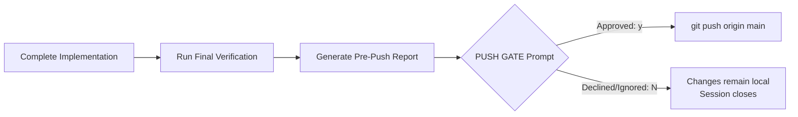
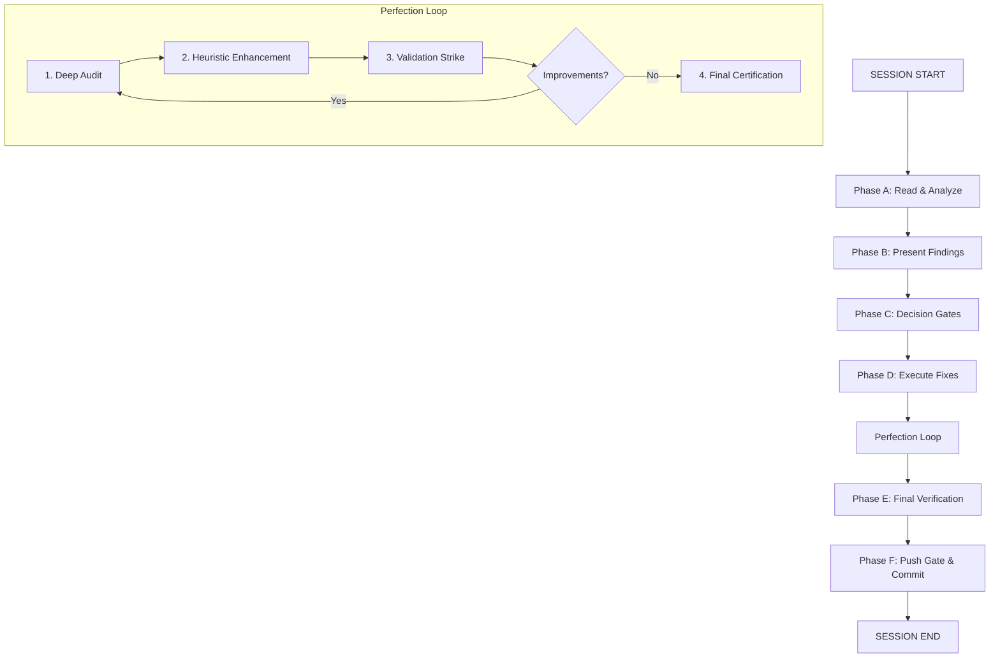
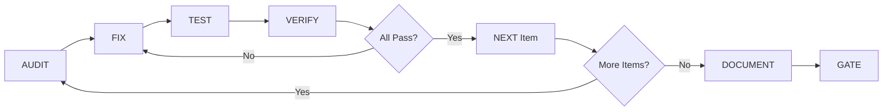
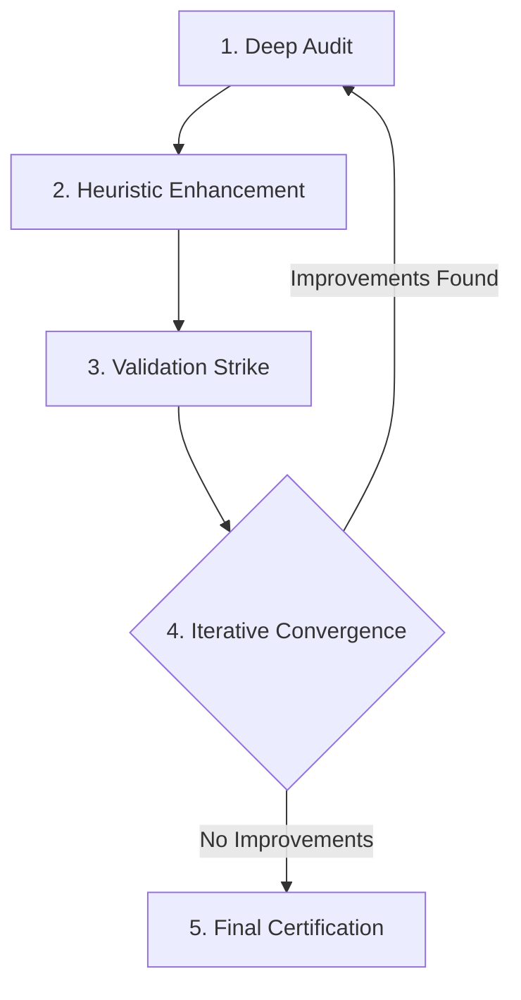

# 🛡️ Unified Development & Autonomous Workflow Protocol

> **Version:** `2.0.0` &nbsp;|&nbsp; **Status:** 🔒 Active &nbsp;|&nbsp; **Last Updated:** 2026  
> **Purpose:** A single, comprehensive, self-contained methodology for all development sessions. Merges surgical FID-based fixes, the Perfection Loop sub-routine, and the proven autonomous overnight workflow into one rigorous protocol.  
> **📋 Instruction:** Read this first. Check `dev/fids/` for the active FID. Follow precisely. **The Push Gate is absolute.**

---

## 📑 Table of Contents

<details>
<summary>🔽 Expand Navigation</summary>

1. [🧠 Core Philosophy](#-core-philosophy)
2. [🚪 The Push Gate](#-the-push-gate)
3. [🏗️ Workflow Architecture](#️-workflow-architecture)
4. [📑 FID System & Tracking](#-fid-system--tracking)
5. [⚙️ Unified Execution Phases](#️-unified-execution-phases)
6. [🛡️ Execution Rules & Anti-Patterns](#️-execution-rules--anti-patterns)
7. [🏆 Quality Standards](#-quality-standards)
8. [🛠️ Common Fix Patterns](#️-common-fix-patterns)
9. [🔍 Signal Path Tracing](#-signal-path-tracing)
10. [🤖 Operating Modes](#-operating-modes)
11. [🚨 Emergency Procedures](#-emergency-procedures)
12. [📂 Reference File Structure](#-reference-file-structure)

</details>

---

## 🧠 Core Philosophy

> 💡 **Every session is a surgical operation on a highly interconnected codebase.** One change in file A can break logic in file Z. The only way to solve this is with a protocol that forces full understanding before every change.

### ⚖️ The Three Laws

| Law | Directive | Enforcement |
|:---|:---|:---|
| 📖 **Read 0-EOF before touch** | Every file read completely before any edit | No exceptions. No skimming. No assumptions. |
| 🗣️ **Present before act** | Every change presented with impact analysis BEFORE implementation | No silent autonomous changes. |
| ✅ **Verify before proceed** | Every change verified with `cargo check --workspace` and `npx tsc --noEmit` | No broken builds. Ever. |

> ⚠️ **Additional Rule:** If you encounter **ANY** issue — even outside the current scope — you flag it for guidance. Never skip past a problem because *"it's not what we're working on."*

---

## 🚪 The Push Gate *(Non-Negotiable & Absolute)*

> 🔐 **DEFAULT STATE:** `🔒 NO PUSH.`  
> All work is staged and committed locally, but **never** pushed to `origin/main` without explicit, session-specific approval. This overrides any prior autonomous push behavior. Even during overnight autonomous runs, the agent halts at `git commit` and awaits gate clearance.

### 📋 Push Gate Protocol



**Step-by-Step Execution:**

1. ✅ Complete all implementation, testing, documentation, and local tracking updates
2. 🔍 Run final verification:
   ```bash
   cargo check --workspace
   cargo test --workspace
   cargo clippy
   cargo fmt --check
   ```
3. 📊 Generate a pre-push report: metrics, changelog summary, commit hash, file diff stats
4. 🎯 Prompt user:
   ```
   PUSH GATE: Ready to push <N> files to origin/main. Approve? (y/N)
   ```
   - **If approved:** `git push origin main`
   - **If declined/ignored:** Changes remain safely committed locally. Session closes.

---

## 🏗️ Workflow Architecture & Diagrams

### 📐 Session Workflow Architecture



### 🔁 Autonomous Loop Structure



---

## 📑 FID System & Tracking

> 🗂️ All work is tracked through **FIDs** (Fix Implementation Documents). We always work off FIDs. Every FID has auditable history.

### 📄 FID Structure Template

```markdown
# FID-YYYYMMDD-DESCRIPTION

| Field            | Value                              |
|------------------|------------------------------------|
| **Document ID**  | FID-...                            |
| **Date Created** | YYYY-MM-DD                         |
| **Status**       | OPEN / FIXED / CLOSED              |
| **Priority**     | CRITICAL / HIGH / MEDIUM / LOW     |
| **Phase**        | Phase name                         |

## Context
## Issue: [Description]
### Symptoms
### Root Cause Analysis
### Fix Plan (with impact matrix)
### Verification Checklist
## Notes
```

### 🔄 FID Lifecycle

| Status | Definition |
|:---|:---|
| `OPEN` | Issue identified, analysis in progress |
| `FIXED` | Code changes made, needs live test |
| `AWAITING VERIFICATION` | Awaiting test confirmation |
| `CLOSED` | Verified working, documented in changelog |

---

## ⚙️ Unified Execution Phases

### 🟦 Phase 1: Initialization & Re-orientation

> 🎯 **Goal:** Re-familiarize and establish baseline before touching anything.

**✅ Context Re-orientation:**
- Read last session summary
- Read this workflow file
- Read `dev/fids/progress.md`
- Read active FID
- Read `dev/CHANGELOG-INTERNAL.md` (unreleased)

**🔍 Baseline Check:**
```bash
cargo check --workspace
npx tsc --noEmit  # If frontend changes were made
git log --oneline -10
git status --short
git diff --stat
```

**📁 Dev Folder Audit:** Understand tracking files:
- `dev/IMPLEMENTATION-TRACKER.md`
- `dev/PENDING.md`
- `dev/coding-standards/`
- `dev/SAVANT-CODING-SYSTEM.md`

**📚 Source File Pre-Read:** If the active FID references specific files, read them 0-EOF **BEFORE** analysis. Understand purpose, imports, data flow, and call chains.

**🗺️ Scope Mapping:** Create a prioritized task list:
- One item per feature/fix
- Priority: `HIGH` / `MEDIUM` / `LOW`
- Status: `pending` / `in_progress` / `completed`

> ✨ **Success Criteria:** Full scope understood, baseline compile/test state documented, prioritized task list created, key files read.

---

### 🟨 Phase 2: Planning & Approval Gates

> 🎯 **Goal:** Present a surgical plan and wait for explicit approval.

**📋 Execution Steps:**

1. 📖 Read every file referenced in the target FID 0-EOF
2. 🔗 Trace the full signal path: `input → processing → output`
3. 🗣️ **Present to User:**
   - Root cause analysis / Implementation plan
   - **Impact matrix:**

     | File | Change | Blast Radius | Risk |
     |:---|:---|:---|:---|
     | `file.rs` | Description | What it affects | `LOW`/`MED`/`HIGH` |

   - Verification steps
   - Draft changelog entry

4. 🚦 **Decision Gate:** If approaches are ambiguous, present options with pros/cons. Wait for explicit approval. **No code changes until approved.**

---

### 🟧 Phase 3: Execution & The Perfection Loop

> 🎯 **Goal:** Implement each item with AAA quality using the Perfection Loop sub-routine.

For each feature/fix, execute the **Perfection Loop** sequentially:

#### 🔍 The Perfection Loop (Full Protocol)



| Step | Name | Key Actions |
|:---|:---|:---|
| **1** | 🔍 Deep Audit | Read all target files COMPLETELY (0-EOF). Analyze for redundancy, tech debt, security. Verify compliance with standards. |
| **2** | ⚡ Heuristic Enhancement | Apply performance optimizations. Enhance error handling. Refine UI/UX. **Never** introduce `unwrap()`, `todo!()`, `unimplemented!()`, or `as any`. |
| **3** | ✅ Validation Strike | Rust: `cargo check` + `cargo test` pass with zero warnings. Frontend: `npx tsc --noEmit` + `npm run lint` pass. Verify unit/integration tests. |
| **4** | 🔁 Iterative Convergence | If improvements found: implement → return to Step 1. Track iteration count. If none: proceed to Final Certification. **Checkpoint:** >3 iterations → reassess scope. |
| **5** | 🏆 Final Certification | Report final metrics. Include iteration count & improvements. Deliver: final code, verification commands, updated docs. |

#### 📉 Perfection Loop Termination Criteria

| Condition | Action |
|:---|:---|
| Deep Audit yields ZERO actionable improvements | Proceed to Final Certification |
| User explicitly requests to ship | Proceed to Final Certification |
| 5 iterations reached without convergence | Flag for review (possible architecture smell) |
| Diminishing returns detected | Recommend ship |

> 💡 **Usage Triggers:** State `"Run perfection"`, `"Initiate perfection loop"`, or `"AAA audit this module"`.

#### 📜 Execution Rules During Loop

- ✅ One feature at a time. Complete → verify → document → next
- 🤝 Use parallel task agents for exploration before implementing
- 🚫 **Anti-Loop:** Never re-read a file you already know. One edit per file per feature. Decide, act, move on.

---

### 🟩 Phase 4: Test Repair & Quality Verification

> 🎯 **Goal:** Guarantee a pristine, production-ready state.

**🧪 Run Full Suite:**
```bash
cargo test --workspace -- --test-threads=1
```

**🔧 Fix Failures:** For each failure:
1. 📖 Read the failing test file. Understand expectations.
2. 🛠️ Fix the code **or** fix the test (whichever is correct).
3. 🔁 Re-run: `cargo test -p <crate> <test_name> -- --nocapture`

**📋 Common Failure Patterns:**

| Pattern | Solution |
|:---|:---|
| Stale API | Update test |
| Wrong imports | Fix path |
| Shared state | Use unique temp paths (`uuid::Uuid::new_v4()`) |
| Assertion mismatch | Fix test |
| Doc-test outdated | Update example |

**✨ Final Quality Sweep:**
```bash
cargo check --workspace                    # 0 errors, 0 warnings
cargo clippy --all-targets -- -D warnings
cargo fmt --check
cargo clean && cargo check --workspace     # Anti-stale-artifact check
```

---

### 🟦 Phase 5: Documentation & Tracking Update

> 🎯 **Goal:** Update all relevant documentation to reflect changes.

| File | When to Update | What to Update |
|:---|:---|:---|
| `dev/IMPLEMENTATION-TRACKER.md` | After EVERY feature/fix | Status, progress |
| `dev/fids/FID-*.md` | During and after fix | Status → `FIXED` or `CLOSED`, verification checklist |
| `dev/CHANGELOG-INTERNAL.md` | After EVERY fix | Detailed fix description with file, issue, approach |
| `CHANGELOG.md` (root) | Only at release milestones | User-facing changes |
| `docs/GAP-ANALYSIS.md` | After gap analysis | Feature roadmap updates |
| `README.md` | Only if user-facing features changed | Public documentation |

> 📝 **Documentation Rules:** Be specific (paths, line numbers, function names), honest (document limitations), concise, use tables for structured data, include metrics.

---

### 🟥 Phase 6: Commit & The Push Gate

> 🎯 **Goal:** Stage changes, commit cleanly, and halt at the gate.

#### ✅ Pre-Commit Checklist

- [ ] `cargo check --workspace` passes (0 errors, 0 warnings)
- [ ] `cargo test --workspace` passes (0 failures)
- [ ] All trackers updated
- [ ] No secrets or API keys in committed files
- [ ] No temporary files or build artifacts staged

#### 📝 Commit Message Format

```text
<type>: <short description>

<optional body>
- Bullet point of changes
- Another change
```

**Valid Types:** `feat` • `fix` • `docs` • `refactor` • `test` • `chore`

#### 📦 Execute Commit

```bash
git add -A
git commit -m "<type>: <description>"
```

> 🛑 **HALT AT PUSH GATE.** Do not push. Await explicit approval per Push Gate Protocol.

---

### 🟪 Phase 7: Session Summary & Metrics

> 🎯 **Goal:** Create a record of what was accomplished.

**📄 Create `dev/SESSION-SUMMARY.md`:**

```markdown
# Savant Session Summary -- YYYY-MM-DD

## Mission
<Brief description of what was asked>

## Status: COMPLETE

## What Was Done
### Features Implemented / Bugs Fixed
| Item      | Status   | Details                 |
|-----------|----------|-------------------------|
| Feature X | Complete | What was done           |
| Fix Y     | Complete | Root cause & resolution |

### Tests
- Before: X passing, Y failing
- After: Z passing, 0 failing

### Git & Push
- Commit: <hash>
- Files changed: N
- Pushed: Yes/No (Gated)
```

---

## 🛡️ Execution Rules, Anti-Loop & Anti-Patterns

### 📜 Non-Negotiable Code Rules

| Rule | Rationale |
|:---|:---|
| No stubs (`todo!()`, `unimplemented!()`, `// TODO`) | Every feature must be fully functional |
| No `unwrap()` or `expect()` in non-test code | Use `?`, `match`, or explicit error handling |
| No swallowed errors | `let _ = foo()` only for cleanup where failure is acceptable |
| All error paths handled | Every `Result` propagated with `?` or handled explicitly |
| Compilation stays clean | Zero errors, zero warnings after every edit |
| Discovery-based over hardcoded | Query system capabilities, don't assume |

### 📜 Non-Negotiable Process Rules

| Rule | Rationale |
|:---|:---|
| Read 0-EOF before every edit | The codebase is complex and interconnected. Partial reads cause bugs. |
| Present before act | No autonomous changes without approval |
| Verify before proceed | `cargo check --workspace` after every fix |
| Checkpoint gates | Approval between every fix group |
| Changelog every change | Track what was done and why |
| Flag everything | If you see an issue — even outside scope — flag it |

### 🔒 Anti-Loop Protocol (Loop Guard)

> 🚫 **Never** re-read a file you already read in this session  
> 🚫 **Never** re-check what you already know is true  
> 🚫 If you find yourself reading the same file twice → **MOVE TO NEXT FEATURE**  
> ✅ One edit per file per feature. If it compiles, move on.  
> ✅ Never think more than once. Decide, act, move on.

### 🚫 Anti-Patterns (Never Do These)

| Anti-Pattern | Why It's Forbidden |
|:---|:---|
| `"The simplest approach"` | We do enterprise-grade implementations, not simple ones |
| `"Let me just quickly fix this"` | There is no quick fix, every change is surgical |
| Reading only the affected line | You **MUST** read the full file 0-EOF |
| Making changes without presenting | You are a partner, not a rubber stamp |
| Skipping verification | Broken builds cascade |
| Choosing speed over quality | We are never in a rush |
| Minimizing scope to reduce effort | We do it right, not fast |
| `"Good enough"` | Good enough is never good enough |
| Skipping an issue because `"it's not in scope"` | Flag it for guidance |
| Pushing without approval | Hard violation of the Push Gate |

---

## 🏆 Quality Standards: *"Perfection Over Convenience"*

> ⚠️ **This section is non-negotiable and overrides all other considerations.** We are not in a rush. We do not optimize for speed. We optimize for correctness, robustness, and longevity.

### 🔍 The Five Questions

When evaluating an approach, ask:

1. 🌐 Will this work for **ALL** cases, not just the common case?
2. 📈 Will this scale to **1000 agents**, not just 10?
3. 🛡️ Will this survive a **hostile attacker**, not just an honest user?
4. 🗓️ Will this be maintainable in **2 years**, not just today?
5. 🏅 Does this set the **standard for the industry**, not just meet it?

> ❌ If **any** answer is `no` → redesign until all answers are `yes`.

### 📐 Every Line of Code Must Be:

| Attribute | Definition |
|:---|:---|
| ✅ **Correct** | Does exactly what it's supposed to do |
| 🛡️ **Safe** | No panics, no data corruption, no security holes |
| 📦 **Complete** | All error paths handled, no stubs |
| ✨ **Clean** | Readable, consistent naming, no dead code |
| 🧪 **Tested** | Covered by tests, all pass |
| 🔍 **Discovery-based** | Queries system capabilities, doesn't hardcode assumptions |

---

## 🛠️ Common Fix Patterns & Debugging Strategies

### 🛤️ Path Validation (Prevent Traversal)

```rust
// ✅ GOOD
if !user_input.chars().all(|c| c.is_alphanumeric() || c == '-' || c == '_') {
    return Err("Invalid input");
}
let path = base_dir.join(user_input);
```

### ⚡ Async-Safe Error Handling

```rust
// ✅ GOOD
match some_function().await {
    Ok(v) => v,
    Err(e) => {
        tracing::error!("Failed: {}", e);
        return Err(e.into());
    }
}
```

### 💾 Atomic Writes (Write-Before-Delete)

```rust
// ✅ GOOD — insert first, delete after
insert_new_entries()?;   // If this fails, old data is intact
delete_old_entries()?;   // If this fails, duplicates exist temporarily (next run cleans up)
```

### 🔎 Discovery-Based Configuration

```rust
// ✅ GOOD — discovery-based
fn context_window(&self) -> Option<usize> {
    // Query the actual system capabilities
    self.cached_context_window
}
```

### 🔑 Ephemeral Secrets (Runtime-Only, No Persistence)

```rust
// ✅ GOOD — generate once, store in config, never persist
fn generate_ephemeral_secret() -> String {
    let mut hasher = blake3::Hasher::new();
    hasher.update(uuid::Uuid::new_v4().as_bytes());
    hasher.update(uuid::Uuid::new_v4().as_bytes());
    hasher.finalize().to_hex().to_string()
}

// Use the stored secret, generate once if missing
let secret = config.secret.get_or_insert_with(generate_ephemeral_secret);
```

---

## 🔍 Signal Path Tracing (For Debugging)

> 🎯 When investigating a bug, trace the **FULL** signal path end-to-end:

1. 🔍 Identify the entry point (user action, API call, event)
2. 🔗 Follow the data through every layer: `frontend → gateway → agent → response`
3. 📖 Read every file in the path 0-EOF
4. 📊 Build a trace table:

| Step | Component | File:Line | Status |
|:---|:---|:---|:---|
| 1 | Entry point | `main.rs:120` | ✅ Working / ❌ Broken |
| 2 | Middleware | `gateway.rs:45` | ✅ Working / ❌ Broken |
| 3 | Handler | `agent.rs:310` | ✅ Working / ❌ Broken |

5. 🎯 Identify the exact step where the signal dies. Present the full trace.

### 🆘 When You're Stuck:

- 📖 Read the file you're modifying — **ALL** of it
- 🔗 Read imports & understand types
- 🔍 Search for similar patterns in the codebase
- 🧪 Check tests for usage examples
- 🚩 If still stuck, mark as `BLOCKED` in the FID and move on
- 🚫 **NEVER guess.** If unclear, ask for guidance.

---

## 🤖 Operating Modes & Autonomy Levels

| Level | Description | Push Behavior |
|:---|:---|:---|
| **Level 1: Guided**<br>*(User Present)* | Agent asks before each major change. User approves each commit. | Local commit only. Push requires explicit `y` at gate. |
| **Level 2: Supervised**<br>*(User Available)* | Agent works independently but pauses at decision points. User can intervene. | Local commit only. Push requires explicit `y` at gate. |
| **Level 3: Autonomous**<br>*(User Away)* | Agent works completely independently. Makes all decisions, implements, tests, documents. | Local commit only. Push **HALTS** at gate until user returns or pre-clears. |

### 📝 Granting Level 3 Autonomy

> **User statement:**  
> `"I'm granting full autonomy. Work through the todo list, but respect the push gate."`

> **Agent behavior after grant:**  
> Create comprehensive todo list → Work through each item independently → Fix any issues encountered → Update all documentation → Commit locally → **STOP AT PUSH GATE** → Create session summary.

---

## 🚨 Emergency Procedures

### 🧪 If Tests Won't Pass

```bash
# Run failing test with verbose output
cargo test -p <crate> <test_name> -- --nocapture

# Check if test is stale (references old API)
# Fix test or fix code, whichever is correct

# If truly stuck, mark feature as PENDING and move on
```

### ⚠️ If Compilation Won't Fix

```bash
# Read the error message carefully
# Check recent changes for typos or missing imports

# Isolate the issue
cargo check -p <specific_crate>

# If stuck, reset and try a different approach
git checkout -- <file>
```

### 🔁 If Looping Detected

> If you've read the same file 2+ times or made the same edit 2+ times:

1. 🛑 **STOP** immediately
2. 🚩 Mark current feature as `PENDING`
3. ➡️ Move to next feature
4. 🔄 Come back later with fresh context

---

## 📂 Reference File Structure

```
docs/
├── architecture/README.md       # System design
├── api/README.md                # Protocol specs
├── security/README.md           # Security model
├── ops/
│   ├── DEPLOYMENT_CHECKLIST.md
│   └── TROUBLESHOOTING.md
└── (Legacy/Archived workflows referenced here)

dev/
├── IMPLEMENTATION-TRACKER.md    # Feature/fix status
├── CHANGELOG-INTERNAL.md        # Session-level change log
├── fids/                        # Fix Implementation Documents
├── PENDING.md                   # Current work items
├── SESSION-SUMMARY.md           # Latest session report
├── coding-standards/            # Language-specific rules
├── SAVANT-CODING-SYSTEM.md      # Meta-instructions
└── roadmap/                     # Issue tracking
```

---

> 📜 **Final Note:** This document supersedes all prior standalone workflow files. It contains the complete Perfection Loop, autonomous execution patterns, FID lifecycle, quality standards, and the absolute Push Gate protocol. **Follow it precisely. Perfection is the standard. The Push Gate is absolute.**

< align="center">

***

**🛡️ Olympus Swarm Development Protocol**  
*Built for resilience. Designed for perfection. Governed by protocol.*

***
